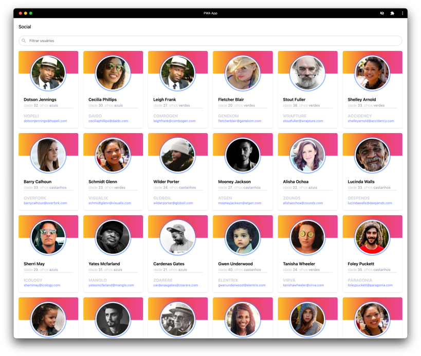

react-apollo-graphql-express
============================

A very simple PWA App sample build with the following stack:

- NodeJS
- Express
- GraphQL (apollo)
- React
  - styled-components
- Docker
- Service Worker

### Run project locally

    docker-compose up

Frontend: http://localhost:3000

Backend: http://localhost:4000

GraphQL: http://localhost:4000/graphql

## Author

**Adriano Rosa** (https://adrianorosa.com)

## Licence

Copyright © 2021, Adriano Rosa  <info@adrianorosa.com>
All rights reserved.

For the full copyright and license information, please view the LICENSE
file that was distributed within the source root of this project.
